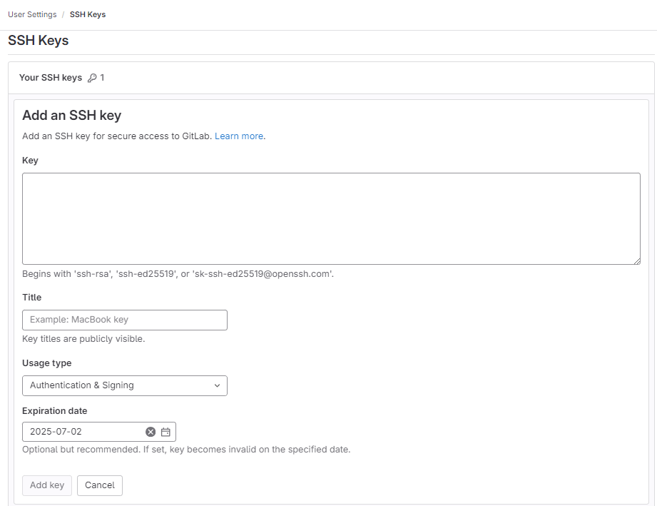
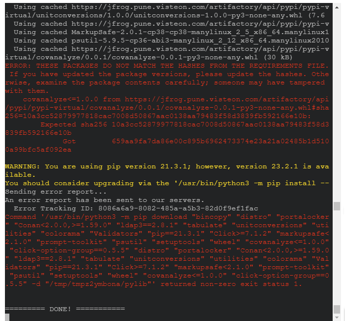
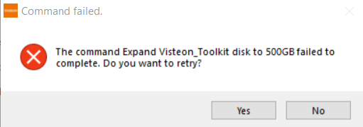

# FAQ

### Can I use X IDE?

Currently Only VSCode and Eclipse are supported natively in VCDT. If enough
request for certain IDE are received and it works along with WSL (the IDE has
a Linux version or support connecting to WSL) then it can be integrated.

### In VSCode can I open programs in new windows instead of reusing current one?

Yes, this is a VSCode setting. To do this in VSCode open the settings (File > 
Preferences > Settings) and search for Open Folders in New Window.

|  |
| :---: |
| **VSCode open folder in new window** |

Change its value to on. This way every time a new folder is opened it will be
open in a new window. This applies for opening the programs from VCDT.

### How can I use SSH for authentication?

To add SSH key you need to open the toolkit settings in VCDT (gear icon > 
Toolkit Settings) and then select the **Authentication** tab. In this tab you
can copy the VCDT public SSH key (or generate it if it doesn't exists).

|  |
| :---: |
| **VCDT SSH Key** |

Once copied the SSH Key is necessary to open the gitlab server to add it. It
is necessary to copy the SSH key to each gitlab server to use (e.g.
https://git.visteon.com/, https://eu.git.visteon.com/,
https://bsp-os.git.visteon.com/, etc.). 

|  |
| :---: |
| **Gitlab Add SSH Key** |

1. Once logged in into the server, select the user > Preferences.
2. Then select the SSH Keys tab.
3. Press the Add new key button.

|  |
| :---: |
| **Gitlab SSH Key** |

Paste the copied key, optionally you can change the title. Also you can specify an
expiration date and finally press on the **Add key** button to add it.

After this you can clone a git repo using ssh. For this to work the manifest
shall be modified to use git@git instead of https in re repos URLs.

### How can I use Personal Access Tokens (PAT) for authentication?

To use PAT in VCDT it is required to open the settings (by pressing the gear icon
on the top right) > Toolkit Settings then select the **AUTENTICATION** tab. In the
section og **Gitlab Personal Access Tokens (PAT)** you can add the token data
for each git server you will use.

|  |
| :---: |
| **Add PAT to VCDT** |

To generate in gitlab you will need to login in the desired server and then click on
the user icon and select preferences.

|  |
| :---: |
| **Add PAT to VCDT** |

Select the Access Token option and press on the **Add new token** button to create
a new PAT.

|  |
| :---: |
| **Create new PAT** |

Finally fill the requested data, provide a name (e.g. develop) set a expiration date
or leave it empty for no expiration date and check the **api**, **read_repository** and
**write_repository** checkboxes to provide that permission to the PAT.

|  |
| :---: |
| **PAT details** |

Press on the **Create personal access token** to create it. The new token will be
provided be sure to copy and paste it on VCDT. This info will not be available
again so if you didn't copy it you will need to delete the PAT and create new one.

# Common Issues

### Program not downloading (harfbuzz)

Some programs could have an issue when downloading due a conan misconfiguration.

|  |
| :---: |
| **Conan Error** |

To fix it open a windows cmd and type:

``` cmd
wsl -d Visteon_Toolkit
conan profile update settings.compiler.libcxx=libstdc++11 default
exit
```

Close the terminal and try the download again.

### Program not downloading (Hashes Mismatch)

When some PIP packages are added to an existing project configuration or required by a new program downloaded,
devNext will trigger an update to download the new packages. It has been observed that the update sometimes
fails with the message THESE PACKAGES DO NOT MATCH THE HASHES FROM THE REQUIREMENTS FILE.

|  |
| :---: |
| **HASHES mismatch Error** |

To fix it open a windows cmd and type:

``` cmd
wsl -d Visteon_Toolkit
python3 -m pip cache purge
exit
```

Close the terminal and try the download again.

### Program not downloading (windows workspace)

It could happen that the download fails with the following error:

|  |
| :---: |
| **Host Download Error** |

You only need to retry the download if the error persists please
ask for support.

### Local VSCode is not opening

Local VSCode IDE works a little different from the other local Apps. Normally
a local App will open inside Linux but using GWSL as X Server so it will be
displayed as a normal Windows App. But the local execution of VSCode requires
to have VSCode installed on Windows with the following extension.

|  |
| :---: |
| **VSCode WSL extension** |

### APT package not found

If having a similar issue when trying to download a program

|  |
| :---: |
| **VSCode WSL extension** |

This is because the APT packages are not up to date. To update it open a
windows cmd.exe and type: 

``` cmd
    1. wsl -d Visteon_Toolkit
    2. sudo apt update
```

After the updates completes close the terminal and try the download again.

### Disk resize failed

When installing the VCDT the disk size will be resized. This doesn't means that
it requires all that space only that it will be able to grow up to that size.
But sometimes this step of the installation fails.

|  |
| :---: |
| **VSCode WSL extension** |

This is because to resize the disk the WSL should not be running so if you have
this error try typing in the cmd:

``` cmd
wsl --shutdown
```

And also verify no other WSL distro is running (like DI Apps Toolkit) and then
try again. If still not working try restarting th PC and execute the installer
as soon as the PC starts up.

### Download program shows 'Loading Variables' forever

When trying to download a program the variables are complete to load.


This can be caused because some environment variables were not set correctly
during the installation. Please open the file ~/.profile and verify that the
following variables are present at the bottom of the file.

``` bash
export WINDOWS_PATH=/mnt/c/Users/mdelafu1/AppData/Local/Programs/Visteon_Toolkit
export DISPLAY=$(cat /etc/resolv.conf | grep nameserver | awk '{print $2; exit;}'):0.0 #GWSL
```

For the **WINDOWS_PATH** use the path where the toolkit was installed by default
is installed in the user folder (in the example /mnt/c/Users/mdelafu1) and in the
**AppData/Local/Programs/Visteon_Toolkit** subfolder. If the toolkit was installed
in a different path please update accordingly.

### Git commands for the programs downloaded in Windows doesn't work

After cloning a program that is downloaded on windows file system.


Try to check if the git repositories are visible in VSCode or try to execute a git
command. If the programs are not shown on VSCode or the git commands are failing
try opening a **cmd.exe** in the folder where the **.git** is located and execute
a **dir** command.


If the directory is shown as **JUNCTION** normally it should be shown ad a
**SYMLINKD** then the symlinks are not working properly on you windows setup.
For now we don't know why this happens but the walk around is to use the VSCode
web to execute the git commands and use the Windows VSCode to edit and compile
the code.


### Windows Git file too long

Windows support long path to create paths of more than 256 characters. This is
configured in the Windows registry (instructions [here](https://git.visteon.com/di/tools/vbuild/-/wikis/Long-Paths-on-Windows-10)).
But this doesn't configure GIT to support long paths. To enable long paths
is GIT type the following command in a cmd.

``` cmd
git config --system core.longpaths true
```

### VCDT can't find powershell

Sometimes after a Windows update the environment variable **Path** is modified provoking that
powershell command is not found and the VCDT doesn't launch.

|  |
| :---: |
| **Powershell not found** |

To fix this issue open the environment variables and verify/add the following paths to the
**Path** variable:

* %SystemRoot%
* %SystemRoot%\\system32
* %SYSTEMROOT%\\System32\\WindowsPowerShell\\v1.0\\

Then restart VCDT and try again.

### Package not found (net-tools)

If when executing a devNext (update/build) command you receive an error like this:

|  |
| :---: |
| **net-tools not found** |

It will be required to install the required package. To do it open a windows terminal
and type:

``` cmd
wsl -d Visteon_Toolkit
sudo apt-get install net-tools
exit
```

### Git Windows - Python not found

If you cloned a program in Windows using the VCDT and when trying to perform a git
action like a commit you receive an error message like the following:

|  |
| :---: |
| **Python was not found** |

Be sure to have Python installed and available in the windows PATH. If the errors
still present try opening the path where python was installed and make a copy
of **python.exe** and rename it as **python3.exe**.

|  |
| :---: |
| **Add python3.exe** |

Then close the terminal or IDE, open it again and try.

### Not able to get Tasking license due Anonymous User

If you are being detected by the tasking server as anonymous as shown in the image.


To fix it you only need to type the following command in a windows cmd.exe

```
wsl.exe -d Visteon_Toolkit sudo usermod -c <CSID> <CSID>
```

Replacing \<CSID\> with the your CSID for example:

```
wsl.exe -d Visteon_Toolkit sudo usermod -c mdelafu1 mdelafu1
```

### Some GUI Apps are not opening (e.g. eclipse)

This error happens due an issue with the nVidia drivers and the current version
of WSL kernel. To be able open the program it is required to change to software
rendering. To achieve this open the VCDT Settings (Gear Icon > Toolkit Settings)
and mark the checkbox: Use Software Render (Can fix some apps not launching).

Once activated try opening the app again if it still doesn't open press the
**Restart VCDT** button and try again.

### DevNext for Windows not detected

Not able to download a program that is isolated for Windows because DevNext
for windows was not detected.

|  |
| :---: |
| **DevNext for Windows Not Detected** |

To fix this in the DevNext Settings select the Windows Tab and configure set the path
to the python version you want to use.

|  |
| :---: |
| **DevNext for Windows** |

Then press the install button if DevNext is not already installed. Optionally
enable PAT and try to download the program again.

If you still have issues to install DevNext for windows please contact DevNext
team for support on installing DevNext on Windows.

### AI support failed to install

If the installation appeared to be successful but AI still not enabled please
try restarting you PC and try the installation again.

This error happens when ollama is installed but for some reason it is not
able to use the port 11434 so it can't initialize and .the required models
are not able to be installed. If the error persist please verify that there
is no other program that could be using that port.

### Python module not found on DevNext 4

When updating to DevNext 4 some programs could be showing an error similar to

```cmd
ModuleNotFoundError: No module named 'colorama'
```

Where **colorama** could be any other module. To fix this error type the following
command in windows cmd.

```cmd
wsl.exe -d Visteon_Toolkit
curl -ks "https://jfrog.sofia.visteon.com/artifactory/Devops-Application-Engineering/devNext/dn400_patch.py" | python3
```

Close the terminal and try again. For more details please refer to:

[https://q2a.visteon.com/t/devnext-4-0-0-package-import-error-fix/520](https://q2a.visteon.com/t/devnext-4-0-0-package-import-error-fix/520)

# Open Issues or Request New Features

If you found an error or want to request a new feature please open an issue
in [toolkit gitlab repo](https://eu.git.visteon.com/devops/tools/VisteonToolkit/toolkit/-/issues/?sort=created_asc&state=opened&first_page_size=100).

If the issue is related to a specific tool please open it in the specific
gitlab repo of that tool. All the tools can be found [here](https://eu.git.visteon.com/devops/tools/VisteonToolkit/toolkit)
