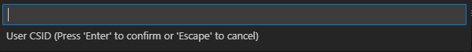

# Introduction

DevNext is the main component used to configure the workspace with the required
tools to build and download the project code. But also it provides the
commands to build the program.

To obtain more details on how to use and configure DevNext please refer to its
official documentation. An example on how to create an initial ini file can be
obtained from [here](https://eu.git.visteon.com/devnext/devnext_v3/-/wikis/Sample-DevNext-Profile-file).

Besides the official DevNext configuration additional comments can be added to
the ini file to allow VCDT to aid in the options a command could require. In
this document we will review how an ini file can be modified to achieve this.

# Add predefined options to a build command

It is common that some build commands could require the developer to provide a
value to be used in order to compile for example an specific variant or XML
file.

``` ini
[build]
gp = vbuild --variant "$${BOARD_VERSION}" "$${BUILD_BASE_LOCATION}"/"$${PROJECT_NAME}"/gp-build/"program_${projectname:VARIANTNAME}" release install
```

The previous build command is used to compile GP code but it requires several
options to know how to compile correctly. This is an special project 
configuration since it allows to download three  programs to the same workspace
so we need to specify several variables to be sure that we are compiling the
correct code.

* **BOARD_VERSION** User need to specify the board version to be used, the
  valid options are: V710_ED3, V769_ED3 and V363_ED3.
* **BUILD_BASE_LOCATION** This is a variable that is already defined in the
  ini file so we don't need to do any additional action.
* **PROJECT_NAME** is the specific program we want to build, the programs are
  stored in different model years folder and different program folder so the
  valid options are: my2023/v710, my2024/v769 and my2024/v363

To automatically provide these options to the user instead of forcing to search
for the correct values we need to add only a few comments in the build section.

``` ini
#PROJECT_NAME=my2023/v710,my2024/v769,my2024/v363
#BOARD_VERSION=V710_ED3,V769_ED3,V363_ED3
#VARIANT=v710,v769,v363

[build]
gp = vbuild --variant "$${BOARD_VERSION}" "$${BUILD_BASE_LOCATION}"/"$${PROJECT_NAME}"/gp-build/"program_${projectname:VARIANTNAME}" release install
```

As can be observer is pretty straightforward after the comment '#' you only
need to add an equal sign '=' and then the valid options separated with
a comma.

# Special scenarios

There are some scenarios that are also covered and if required support for
additional ones could be added. The current supported scenarios are:

### No options but want to add a hint

Some times there are no specific options predefined but it is useful to
provide a hint to the user so he will be able to put the correct value.

``` ini
#USER=<User CSID>
```

To add this hint it is only required to put the description inside '<>'.
This will be parsed by VCDT and when executing the command in the IDE this
hint will be provided

|  |
| :---: |
| **Hint for the command input** |

### Input variable should be taken from environment variable

Sometimes the command will require to use an environment variable instead
of a value in the ini file or obtained from the user.

``` ini
# REPO_RREV=<ENV_VAR>
reporev = repo forall -c 'git checkout $${REPO_RREV}'; 
```

To allow the variable to be handled like this set the comment as **<ENV_VAR>**
to allow VCDT to know that is value will not be available either in the ini
or expected the user to provide it.
