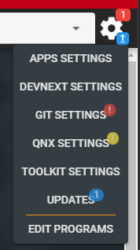
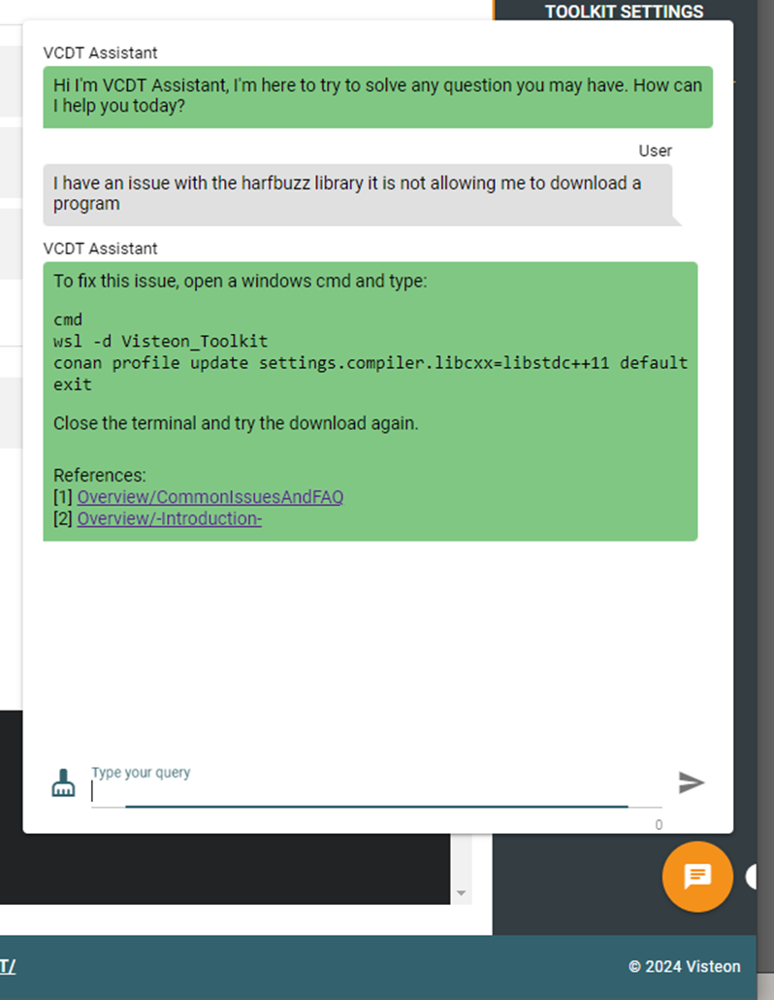

VCDT was designed to simplify the installation and use of all the required
tools to develop software. Some of the executed configurations are:

* WSL Ubuntu Installation
* GWSL Installation to execute graphical apps
* DevNext Configuration
* GUI interface through Web Browser
* IDEs integration
* Download and deletion of programs
* Simple build commands through IDEs
* Additional tools like Beyond compare and VectorCAST
* Custom tools (developed using the VCDT tool framework, anyone can create their own!)


# Prerequisites

Before installing the the VCDT is important to meet the following 
requirements:

* Administrator permissions in Windows
* Install WSL with the Kernel 5.10.16. For Visteon employees please install it
  from the Software Center (Install both). For external users please contact
  your IT team to obtain support on how to install WSL with this specific
  Kernel version.

|  |
| :---: |
| **VSCode WSL extension** |


# Install

Once the prerequisites are meet you can download the installer form
[this link](https://jfrog.mexico.visteon.com/ui/native/docker-di_apps/toolkit/installers/).
Be sure to download the latest installer version.

The installation is composed by two parts. The first part is executing the
Visteon_Toolkit_X.Y.Z.exe that contains everything that is required to install the
VCDT. Only follow the steps provided by the installer.

Once the installation is complete and the VCDT is executed the first time
it will be required to execute the second part of the installation.

|  |
| :---: |
| **Install/Reinstall VCDT** |

Before starting with the installation a message box asking if you are a
Visteon employee will be displayed. If you press no additional configurations
related to the proxy will be applied to the distro install.

|  |
| :---: |
| **Visteon Employee** |

This installation will create the WSL distro but before that it will check if
GWSL is already installed on your machine if not it will launch the GWSL
installer.

|  |
| :---: |
| **Install GWSL** |

After GWSL is installed the WSL distro will continue to be configured, it
will require admin permissions to increase the default 256GB virtual disk
to 1TB.

|  |
| :---: |
| **Admin permissions** |

Don't worry the installation will not use 1TB of space it will allow to store
up to 1TB but it will only use the amount of space used by actual files
inside the distro.

|  |
| :---: |
| **Install complete** |

Once the installation is complete a check for updates will be executed
automatically to be sure that you are using the latest version.

|  |
| :---: |
| **Checking for launcher updates** |

These updates are regarding to the launcher (windows program) and not
related to the VCDT that is running inside the WSL.

|  |
| :---: |
| **VCDT Ready** |

To open the VCDT press the Open Toolkit button. This will perform a check for
the VCDT repo. During the first execution this will clone the VCDT repo
since it is not present.

|  |
| :---: |
| **VCDT Updating** |

Once this is completed the web browser will be open showing the welcome
page of the VCDT.

|  |
| :---: |
| **Welcome to VCDT** |

# Quick Start

We already have VCDT installed now what? The welcome page will have several
sections that will allow us to start to work with the program we want.

By default we will not have any program loaded so we will require to select
the OEM and the program we want to work on then press the red "Program Not
Loaded" button to proceed to download it.

|  |
| :---: |
| **VCDT Main Page** |

1. Program status button that will let us know if program is or is not loaded
   or if it is being downloaded.
2. Product type like IC (Instrument Clusters) or BMS.
3. OEM that we are working on. You can select different one from drop menu.
4. Model year of the program.
5. Program we want to work on. All the program for the selected OEM and Model
   year will be displayed in the drop menu. Note. You can type the name to filter
   the list.
6. Setting. It will show pending actions you need to take care of to have VCDT
   working correctly, also a banner in the top will be displayed. Once selected
   we will be able to see which setting needs our attention.
   
Is important to configure the settings them before moving on.

|  |
| :---: |
| **Settings** |

We can see different types of notifications in the settings button.

* One is the red circle that is an important setting than needs your attention.
  For example we need to configure the GIT credentials by pressing on the GIT
  SETTINGS button.
* Other are the yellow circle. This is an optional pending setting. For example
  configuring the QNX license is only required if you will be compiling a program
  that uses QNX compiler.
* The last one is the blue circle. This will notify pending updates. It could be
  updates for DevNext or updates for the VCDT and/or tools. It is recommended
  to always accept all the updates.

In the main page image we can see that we want to work on the Ford DI Apps program.
Once we press the red button (PROGRAM NOT LOADED) we will be redirected to the
download program page (We can also access this from the DOWNLOAD menu).

|  |
| :---: |
| **Download Program** |

1. By default the PROGRAMS tab will be selected but also it is possible to
   select the DESIGNS tab if you desire to download a design instead
   of the source code.
2. This two buttons allows to delete the downloaded program (minus red circle)
   or add a duplicate of this program (plus green circle).
3. Storage Usage Graph. This will display the space used by each of the
   downloaded programs, apps, cache, etc.
4. Ini file to use. This changes by program but normally Remote manifest
   shall be used.
5. Branch where the manifest is stored normally develop branch is used.
6. Manifest to use to download the code. This also changes by program but
   normally for development the Develop Manifest or a specific Domain
   Manifest can be used.
7. Where to download allows to decide where to download the program (Windows,
   LINUX or even SSH remote server). By default it will have the correct option
   selected but if you know that the program is expected to be downloaded on
   a specific OS you can change it or if you want to use a remote server
   through SSH you can also do it here.
8. This button will start the download process.
9. The output of the download process will be displayed in this console.
10. The cache of Linux is normally cleared after restarting the VCDT but it
   could be possible that you don't want to restart it and it is already too
   big you can use this button to clear it.

The download process will be using DevNext in the backend so all the code and
the required apps to compile the code will be downloaded automatically. If
required by DevNext the credentials will be requested to the user. It is also
possible to use Gitlab Personal Access Tokens or ssh key (please refer to
[Authentication](/#/docs/Overview#-Introduction-/authentication-pat-and-ssh-key) section for details).

|  |
| :---: |
| **Credentials** |

If you are having issues during the download be sure to check the
[trouble shooting](https://toolkit.visteon.internal/#/docs/Overview#CommonIssuesAndFAQ/common-issues) section in the documentation.

Once the download is complete the program will be shown as loaded. And the
Storage Usage graph can be refreshed to reflect the storage that the new
program is using.

|  |
| :---: |
| **Program Downloaded** |

Once downloaded we can observe that program is using around 2GB and the Apps
around 28GB. Once compiled the used space will increase for the program.

To start editing and compiling code you can use VSCode or Eclipse.
Both of them are available in the Apps menu.

|  |
| :---: |
| **Launch VSCoded** |

The Apps can be launched locally or web. When using web a new tab
will be opened and the program will be running inside there. Opening locally
will open application normally using GWSL. For VSCode it is a little bit
different because local will require to have VSCode installed in windows
with the [WSL extension](https://toolkit.visteon.internal/#/docs/Overview#CommonIssuesAndFAQ/common-issues/local-vscode-is-not-opening). It
is possible to set the default opening option in Apps > Add/Remove Apps
and selecting the App then change between local, web or choose that is
the default setting.

|  |
| :---: |
| **VSCode Build** |

Opening the VSCode will open load automatically the selected program loaded.
It will allow you to edit the source code and navigate through
files. To build the code you can press <kbd>control</kbd> + 
<kbd>shift</kbd> + <kbd>b</kbd> to show all the available build commands. 
Selecting one will start the corresponding build.

|  |
| :---: |
| **Eclipse Build** |

Opening eclipse could take some time because it will remove any program
previously loaded and then load the current program you are working on.
Once it is loaded the program folder will be available and all the
required targets to build the code will be available to you. Double
click on one target will start the build.

|  |
| :---: |
| **Eclipse Build** |

It is also possible to press the hammer icon to start the build. This
will show a window with all the available target for you to build the
code.

# Default targets available in all programs

All the build targets that will be displayed when pressing the
<kbd>control</kbd> + <kbd>shift</kbd> + <kbd>b</kbd> in VSCode or as
build targets in eclipse are generated from the devnex ini file. These
are updated automatically after performing a devnext git update or
executing a default target in VSCode. The default targets are always
present along with the targets obtained from the ini file. They are:

* **DevNext Git Update**. Executes the **devnext gitupdate** command,
* **DevNext Refresh Build Commands**. Refresh the build commands generated
  from the ini file. This is useful if you updated the ini file and want
  to see the new targets.
* **DevNext Repo Checkout Revisions**. This command will select the branch
  of each command based on the manifest. By default repo tool checkout
  commit instead of branches.
* **DevNext Repo Clean**. Remove any change in all the git repos of the
  manifest.
* **DevNext Repo Hard Clean**. This command completely removes any change
  in all the git repos. It will also checkout the commit instead of
  a branch. This is useful to be executed before performing a Git Update.
* **DevNext Repo Status**. Performs a repo status command to obtain
  the status of all the manifest repos.
* **KW ***. VCDT will generate a KW target for each target found in the
  ini file. When executed this target it will execute the devnext klocwork
  analysis. Note. The ini file shall be updated with Klocwork details
  in order to these commands to work.

To improve how devnext build command are executed in VSCode using VCDT please
check the [DevNext Inif File](/#/docs/Overview#DevNextIniFile) support in VCDT help.

# Authentication (PAT and SSH key)

VCDT can be configured to support Personal Access Tokens (PAT) and/or SSH
key to download git repositories. To do this press on the settings button
(gear icon on top right) > Toolkit Settings. Then select the Authentication
Tab.

|  |
| :---: |
| **Toolkit Settings Authentication Tab** |

In this tab you can generate your private and public ssh key. Then copy
the public key and add it to gitlab.

|  |
| :---: |
| **Add SSH Key to Gitlab** |

This will be required to be added in all the git servers. Also to use it
is required to clone the repos using ssh instead of http:

``` bash
git clone git@eu.git.visteon.com:devops/tools/VisteonToolkit/toolkit.git
```

If using repo tool manifest then all the remotes shall be updated to use
ssh instead of http. If it is desired to use PAT instead in the same
tab on the VCDT you can add the generated token.

|  |
| :---: |
| **Add PAT from gitlab** |

To make this work along with DevNext it is required to enable PAT in DevNext.
To do this select DevNext Settings and mark the **Enable Personal Access
Token (PAT)** checkbox.

|  |
| :---: |
| **Enable PAT in DevNext** |

It is required to generate and add the PAT for each gitlab server to use.

Also it is possible to enable PAT for Windows DevNext. it is important to also
add the tokens to the Windows Authentication if downloading a program
that is isolated for Windows.

|  |
| :---: |
| **Windows Authentication** |

# Windows DevNext Support

Support to install, configure and download program isolated for Windows was added
to VCDT. In the **DevNext Settings** menu you can select **WINDOWS** to verify if DevNext
is installed in Windows.

|  |
| :---: |
| **Windows DevNext** |

To configure the DevNext Installation to use it is required to provide the path
where the desired version of python to use is installed. Once a valid path is
provided VCDT will check if DevNext is installed if not the **Install DevNext**
button will be displayed to allow you to install devnext in the selected
Python installation.

|  |
| :---: |
| **Windows DevNext Installed** |

Once installed the current DevNext version will be displayed and the button will
change to **Update DevNext** same as when selecting **Linux (WSL)**. It is also
possible to enable/disable the PAT since it will be independent of the Linux
PAT configuration.

# Windows GIT Support

Along with Windows DevNext support now it is also supported to install and configure
GIT for Windows since it is required by DevNext to work properly. If GIT is not
installed it will be required to be installed by the user. A green install button
will appear when GIT is not detected. Pressing it will open the GIT download
page in a new tab please download it and install it.

|  |
| :---: |
| **Windows GIT** |

Once installed Windows GIT can be configured the same way as Linux GIT is
configured. It is required to provide username (CSID) and email to be able to
download programs and commit changes. Other generic setting can also be modified.

# Enable AI (Beta) Support

Following the current AI trends VCDT didn’t want to be behind so the new version of
VCDT has a Beta implementation of AI ready to use. To comply with security od Visteon
PI the AI implementation is not using cloud solutions instead the model and the
inference is executed locally in developers computer so the information exchanged
with the AI will never leave Visteon Network.

**This will impact in my computer performance?**

Yes and no. It will depend on the kind of activities you are performing. Only if your
activities include the usage of intense 3D graphics and high usage of VRAM then you
will be affected so it is recommended to avoid enabling AI in this scenario otherwise
(that is most of the users) can have AI enabled because the CPU or system RAM will
have low to no impact since the model is loaded into VRAM and the inference is
executed in the GPU. But be aware that it could get warm so be sure to have it well
ventilated. In summary lets use the hardware that normally is not used!

**Any computer will be able to run in?**

No, the minimum requirements is to have a newer GPU with at leas 8GB of ram (like the
NVIDIA RTX A2000 that newer laptops have). If your computer doesn’t meet the minimal
requirements the option to enable AI will be disabled.

**I’m in! How can I enable it?**

In the Settings (Gear Icon top left) > Toolkit Settings enable the “Enable Local AI
Support” checkbox,

|  |
| :---: |
| **Enable AI Support** |

This will enable the AI tab and start the installation process. Please read all the
pop-up notifications and proceed with the installation (please note that ollama
install needs user intervention). Wait until the models are downloaded and all the
required packages installed. Once complete verify that the VSCode path is correct (or
install VSCode if not installed) and press on the “Install AI extension in VSCode”
button.

|  |
| :---: |
| **Install AI Extension in VSCode** |

Once this is completed you are ready to start using the AI functionalities!

**Great! But what I can do with it?**

Fair question! The first thing to notice is that a new floating icon will appear in
the bottom right corner of the VCDT. Pressing on it will bring a chat window for the
VCDT assistant. This assistant can answer question regarding to VCDT so if you have
an issue you can try asking to see if it can help you to solve the problem.

|  |
| :---: |
| **VCDT Assistant** |

These answers are provided based on the VCDT documentation. Later on it is planned to
increase its “knowledge database” with different documents like datasheets,
specifications and other useful material required for day to day work.

But also we have the VSCode extension. This extension (named Continue) will provide a
Copilot like behavior to the VSCode providing features like:

|  |
| :---: |
| **Chat** |

|  |
| :---: |
| **Autocomplete** |

|  |
| :---: |
| **Edit** |

|  |
| :---: |
| **Actions** |

And more! Please refer to the extension documentation by pressing the “Extension
documentation” button.

|  |
| :---: |
| **Continue Extension Documentation** |

Or by opening this link directly: https://docs.continue.dev/getting-started/overview

***Something else I need to know?***

Yes! Remember that since the hardware limitations we are using a small model so the
behavior and the responses will not be always correct so don’t assume that the
responses are right please be sure to double check them. In the future it could be
possible that Visteon have a dedicated AI server that will be able to run bigger and
more powerful models that can be used by the VCDT and the VSCode extensions allowing
any computer to benefit from it but for now we can start to benefit with this
implementation. Also VCDT will be updated to use newer and better models so be sure
to keep up to date to benefit from this.

> **_IMPORTANT!_** Don’t use web models that are not authorized by Visteon to avoid IP to be filtered.

# Common issues during install

### Disk resize failed

When installing the VCDT the disk size will be resized. This doesn't means that
it requires all that space only that it will be able to grow up to that size.
But sometimes this step of the installation fails.


|  |
| :---: |
| **VSCode WSL extension** |

This is because to resize the disk the WSL should not be running so if you have
this error try typing in the cmd:

``` cmd
wsl --shutdown
```

And also verify no other WSL distro is running (like DI Apps Toolkit) and then
try again. If still not working try restarting th PC and execute the installer
as soon as the PC starts up.

### Update process failed

If after an update you obtain this error when trying to execute the VCDT.

|  |
| :---: |
| **Update Failed** |

You will need to manually download update file
[Visteon_Toolkit_Patcher.exe](https://jfrog.mexico.visteon.com/artifactory/docker-di_apps/toolkit/master/Visteon_Toolkit_Patcher.exe)

Once downloaded execute it and perform the install then try to open VCDT again.

### Unhandled Exception

The first time running the VCDT it fails with an unhandled exception similar
to the following image.

|  |
| :---: |
| **Unhandled Exception** |

Change the OS language to English because currently other languages are not
supported and can provoke this kind of exceptions.
