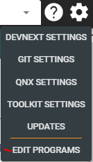
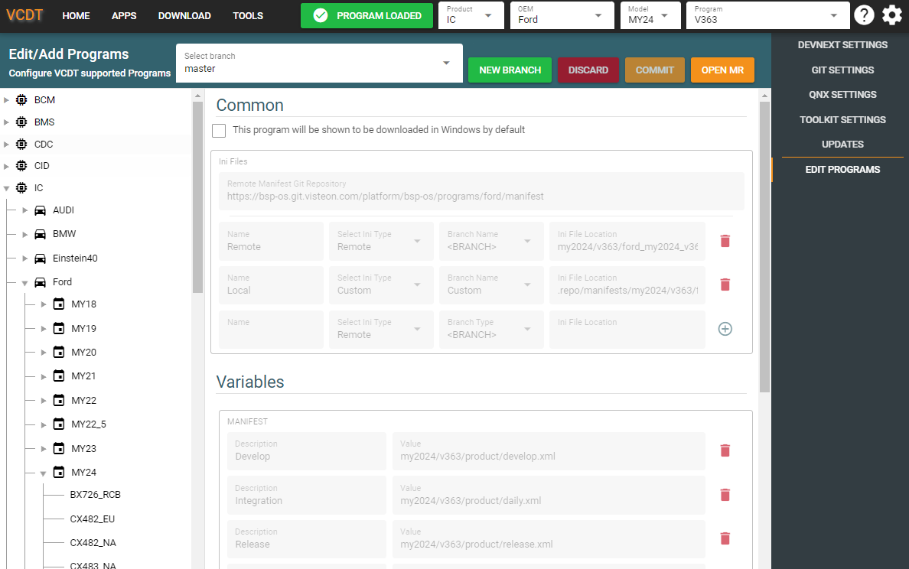
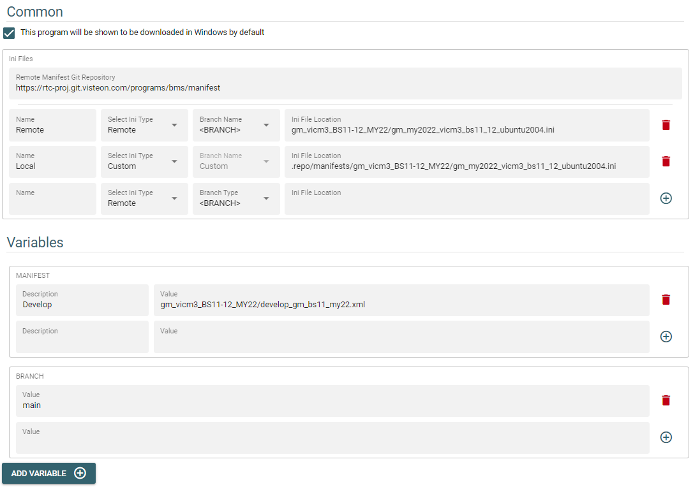
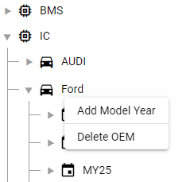

# Introduction

The VCDT is designed to support any program from the different product types
(Cluster, BSM, BCM, etc.) but it is required to add them so they can be
displayed in the drop boxes. This document will describe the process to
add/remove/edit supported programs.

# Show all the currently supported programs

All the modifications for supported programs are handled in the **Edit Programs**
option in the settings.

|  |
| :---: |
| **Edit Programs** |

This setting will retrieve from the server the current configuration of the
selected branch. If required the username (CSID) and password will be required
ro retrieve the information. It is required to have permissions for
[https://eu.git.visteon.com/devops/tools/VisteonToolkit](https://eu.git.visteon.com/devops/tools/VisteonToolkit)
to retrieve the information, create new branches and commit changes.

Once loaded you will be able to see the current selected program configuration.
It is possible to select different programs in the left bar.

|  |
| :---: |
| **Edit Programs Layout** |

The programs are sorted by product type (BMS, IC, CDC, etc.) then by OEM then by
model year and finally by program name. Selecting a different program in the
navigation bar will not change the current selected program only apply for the
programs editor.

No change can be performed in the main branch so it will be required to create a
new branch to add, remove or modify programs.

# Modifying a program

To modify a program first it will be required to select a different branch. If
a branch already exists then it can be selected from the **Select Branch** drop
menu. If a new branch is desired then pressing the **New Branch** button will
allow to create it. All the branches shall start with a **feature\/** the name
of the branch.

Once a different branch is selected it can be deleted by pressing the **Delete**
button. This will remove the local and remote branch so be careful when deleting
a branch because it can't be undone. Also after the branch is selected the fields
in the project details will be enabled allowing to modify them.

|  |
| :---: |
| **Editable Program Fields** |

The fields to edit are:

* **Checkbox**. This checkbox is used to identify if a program shall be loaded in
  Windows workspace (checked) or if it shall be loaded in WSL (Linux build).
* **Remote Manifest Git Repository**. This field contains the URL of the git repo
  that contain the manifest files. This URL will be also used to read the ini.
* **Name**. Name of the ini file to be used. Normally it is set as Remote to
  specify that this ini file will be downloaded from the server.
* **Select Ini Type**. This is used to specify from where the ini file will be
  retrieved. If used **Remote** the **Remote Manifest Git Repository** will
  be used as root and the **Ini File Location** will be a relative path in this
  server. If used **Custom** the value defined in **Ini File Location** will
  be used if no url is provided a relative path in the project path in the host
  will be used.
* **Branch Name**. Only supported when using **Remote** for the ini type. If set
  to **\<BRANCH\>** it will use the value of the variable **BRANCH** this is the
  recommended option, if **Custom** is used the branch name to use shall be added
  to the **Ini File Location**.
* **Ini File Location**. Relative path where the ini is stored.

**Note**. Please be sure to press the **plus** button to add the option otherwise
it will not be stored.

The **VARIABLES** section contains the variables that are required by the ini file
to download the code. **MANIFEST** and **BRANCH** are standard variables that will
contain the different manifests files that can be used in the project and the branch
name to use to download the code. If required additional variables can be added with
the **ADD VARIABLE** button.

# Add/Remove OEM, Model Years and Programs

To add or remove it is also necessary to have a branch selected. Once a branch is
selected right click on the desired element will show a contextual menu that will
allow to add sub elements or delete current element.

|  |
| :---: |
| **Add/Remove Element** |

Adding new element will show a pop up window that will allow you to specify the
name of the element to add. Once the changes are completed is important to press
the **commit** button to save the changes in the branch. The **discard** button
will remove any local change that hasn't been committed yet.

# Merge changes

To deliver the changes it is required to create a merge request from the current
branch into de master branch. The **Open MR** button will open a new tab where
the Merge Request can bre created. After merging the branch to master it is
recommended to return to delete de feature branch in the VCDT by pressing the
**Delete Branch** button. This will remove the branch locally and in the server
and check out the master branch again.
